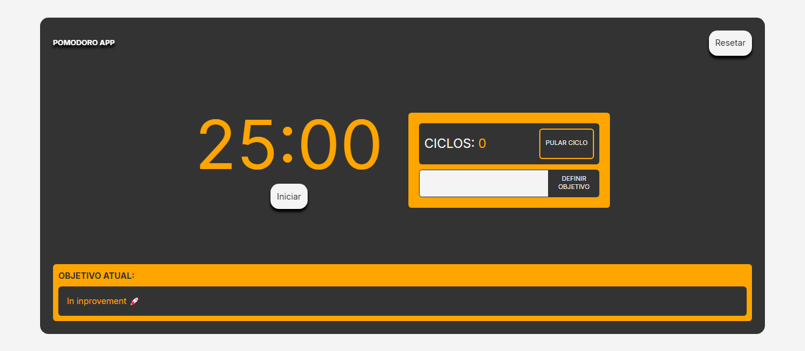

# ⏱️ Pomodoro app

### Um app de Pomodoro simples, rápido e responsivo feito com **React + TypeScript**, utilizando **Vite** para build e **Tailwind CSS 4.0** para estilização.

## ✨ Preview

[🔗 Acesse a versão online aqui 🌐](https://pomodoroapp-teal.vercel.app/)



## 🚀 Tecnologias

- ⚛️ **React** – Interface declarativa e componentizada
- ⚡ **Vite** – Dev server e build ultra-rápido
- 🧠 **TypeScript** – Tipagem estática para maior segurança
- 💅 **Tailwind CSS 4.0** – Estilização utility-first com design moderno e responsivo

## 📋 Funcionalidades

- Temporizador Pomodoro com ciclos de:
  - 25 minutos de foco
  - 5 minutos de descanso curto
  - 15 minutos de descanso longo após 4 ciclos
- Sistema de ciclos com contagem automática
- Notificações sonoras no fim de cada ciclo
- Responsivo para dispositivos móveis
- UI simples e direta para foco total


## 📦 Como rodar localmente

#### 1. **Clone o repositório:**

```bash
git clone https://github.com/Dev-LDRC/PomodoroApp.git
cd PomodoroApp
```

#### 2. **Instale as dependências:**

```bash
npm i
```

#### 3. **Inicie o servidor de desenvolvimento:**

```bash
npm run dev:local
```

#### O app estará disponível em `http://localhost:5173`.

## 📄 Licença

Este projeto está sob a licença MIT. Veja o arquivo [LICENSE](https://github.com/Dev-LDRC/PomodoroApp/blob/main/LICENSE) para mais detalhes.